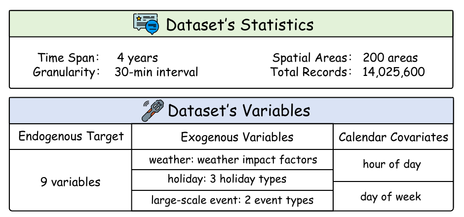
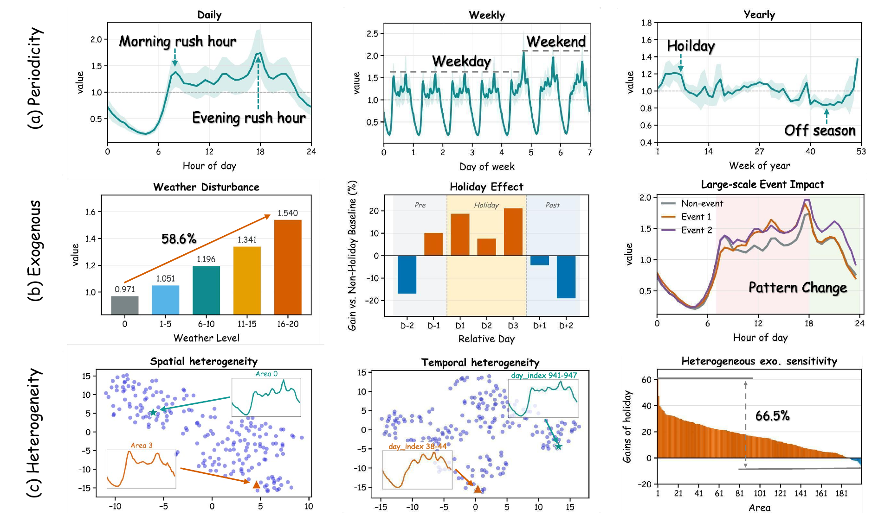
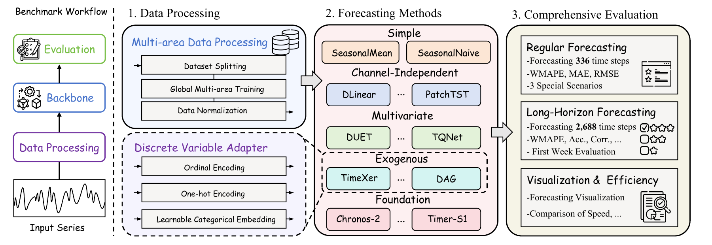
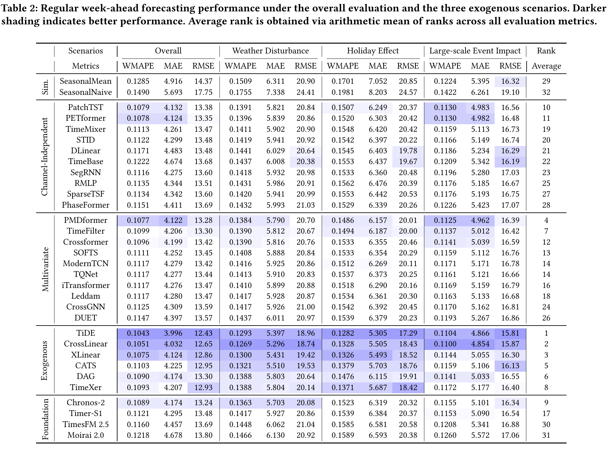
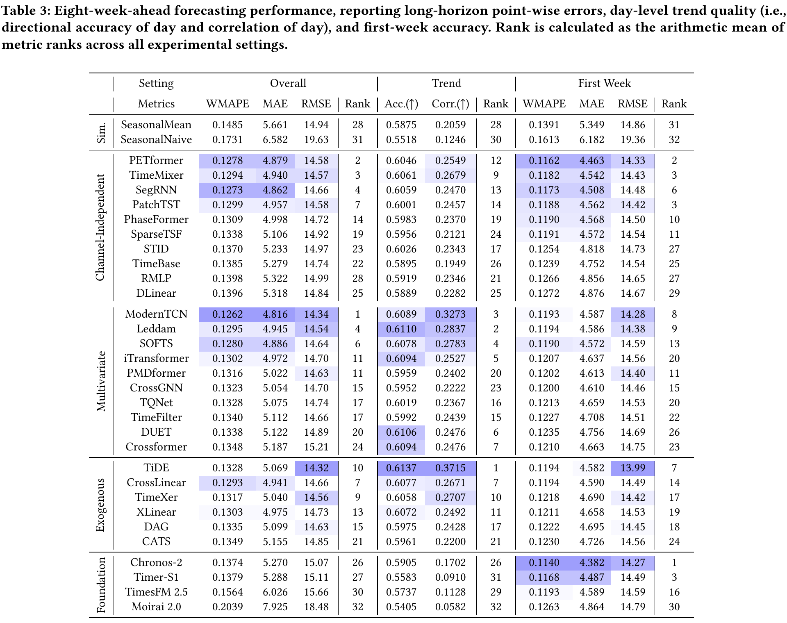

# RideBench

Welcome to the official repository of the RideBench paper: "[RideBench: A Large-Scale Exogenous-Aware Benchmark for Ride-Hailing Time Series Forecasting](https://arxiv.org/pdf/2610.11164)".

[[Paper]](https://arxiv.org/abs/2610.11164) - [[Dataset]](https://outreach.didichuxing.com/opendata/datasets) - [[Code]](https://github.com/ACAT-SCUT/ridebench)

## Updates

🚩 **News** (2026.10): Our paper and benchmark code are now publicly available. The **Ride-Hailing** dataset is available through [DiDi's open data platform](https://outreach.didichuxing.com/opendata/datasets).

## Introduction

**RideBench** is a comprehensive benchmark for **exogenous-aware ride-hailing time series forecasting**, built upon **Ride-Hailing**, a large-scale synthesized dataset derived from DiDi's marketplace data.

Accurate ride-hailing forecasts require models to capture regular temporal patterns while responding to **weather disturbances**, **holiday effects**, and **large-scale events**. They must also generalize across heterogeneous spatial areas and support planning over multiple weeks. RideBench brings these requirements together through a unified evaluation of **over 30 representative forecasting methods**.

Our previous works, [**SegRNN**](https://github.com/lss-1138/SegRNN), [**SparseTSF**](https://github.com/lss-1138/SparseTSF), [**CycleNet**](https://github.com/ACAT-SCUT/CycleNet), and [**TQNet**](https://github.com/ACAT-SCUT/TQNet), explored efficient temporal modeling, periodicity, and multivariate dependencies. RideBench extends this research toward practical forecasting challenges in ride-hailing systems, with an emphasis on **future-known exogenous information**, **multi-area forecasting**, and **long-horizon planning**.

## Ride-Hailing Dataset

**Ride-Hailing** covers **four consecutive years** of observations across **200 spatial areas** at **30-minute granularity**, yielding **14,025,600 records**. It provides **9 endogenous forecasting targets** together with continuous and categorical exogenous variables.



| Property | Description |
| :--- | :--- |
| Time span | 4 consecutive years |
| Sampling interval | 30 minutes, or 48 steps per day |
| Spatial coverage | 200 representative areas |
| Total records | 14,025,600 |
| Forecasting targets | 9 anonymized endogenous variables |
| Weather | Continuous weather impact factor |
| Holidays | Public holidays, traditional festivals, and Western festivals |
| Large-scale events | Two coarse-grained event-impact categories |
| Calendar covariates | Half-hour-of-day and day-of-week indicators |

The dataset preserves three important characteristics of ride-hailing time series: **multi-scale periodicity**, **exogenous effects**, and **heterogeneity**. Daily, weekly, and yearly patterns coexist; external factors can change both demand levels and temporal shapes; and the same disturbance may produce different responses across areas.



**Note:** Ride-Hailing is released as a **synthesized dataset**. Area and variable identifiers are anonymized, and the data undergo transformations to retain forecasting-relevant patterns while protecting sensitive operational information.

## Benchmark Overview

RideBench integrates **standardized data processing**, **representative forecasting methods**, and **comprehensive evaluation protocols**.



### Forecasting Tasks

| Setting | Historical input | Prediction horizon | Evaluation |
| :--- | :--- | :--- | :--- |
| **Regular week-ahead forecasting** | 4 weeks / 1,344 steps | 1 week / 336 steps | Overall accuracy and performance under weather, holiday, and large-scale event scenarios |
| **Long-horizon 8-week-ahead forecasting** | 14 weeks / 4,704 steps | 8 weeks / 2,688 steps | Overall accuracy, day-level trend quality, and first-week accuracy |

The benchmark uses **chronological splits**: the first three years for training, the following six months for validation, and the final six months for testing. A sample belongs to a split only when its **entire prediction window** lies within that split. Historical inputs may extend into earlier periods.

For trainable models, samples from different areas are pooled to train a **shared global model**. Normalization statistics are fitted on the training period, and predictions are inverse-transformed before evaluation on the original scale.

### Forecasting Methods

RideBench evaluates methods from five families:

| Family | Methods |
| :--- | :--- |
| **Simple statistical baselines** | SeasonalNaive, SeasonalMean |
| **Channel-independent models** | DLinear, PatchTST, PETformer, STID, RMLP, SegRNN, SparseTSF, PhaseFormer, TimeBase, TimeMixer |
| **Multivariate models** | Crossformer, CrossGNN, DUET, Leddam, ModernTCN, PMDformer, SOFTS, TimeFilter, TQNet, iTransformer |
| **Exogenous-aware models** | CATS, CrossLinear, DAG, TiDE, TimeXer, XLinear |
| **Time series foundation models** | Chronos-2, Moirai 2.0, TimesFM 2.5, Timer-S1 |

For exogenous-aware models, we provide **ordinal encoding**, **one-hot encoding**, and **learnable categorical embeddings** to handle discrete covariates. The scripts also include **endogenous-only variants** for studying the contribution of external information. Foundation models are evaluated in a **zero-shot** setting.

### Evaluation Metrics

We report **WMAPE**, **MAE**, and **RMSE** for overall and scenario-specific point forecasting accuracy. For the eight-week task, we additionally report **Directional Accuracy of Day (Acc.)** and **Correlation of Day (Corr.)**, calculated after aggregating every 48 half-hourly values into a daily mean. **First-week accuracy** measures near-term reliability within the eight-week forecast.

### Main Findings

**Future-known exogenous variables improve regular week-ahead forecasting.** Exogenous-aware models achieve strong results under weather, holiday, and event scenarios, with TiDE obtaining the best average rank in the regular benchmark. However, categorical holidays and sparse large-scale events remain challenging, and current models still struggle to fully capture disturbance-induced pattern changes.



**Long-horizon forecasting requires more than low pointwise errors.** The advantage of exogenous-aware models becomes less consistent over eight weeks. Pointwise accuracy, daily trend quality, and first-week reliability favor different methods; no existing model dominates all three dimensions.



Additional studies examine **exogenous variable utilization**, **area scaling**, **lookback length**, and **training losses**. These analyses show that pooling more training areas can improve forecasts on fixed target areas, longer historical context is useful up to a point, and MAE provides a strong default training objective in this setting. Please refer to the [paper](https://arxiv.org/pdf/2610.11164) for the complete results and discussion.

## Getting Started

### Environment Requirements

The project requires **Python 3.11**. The training scripts use **CUDA** by default. We recommend using `uv` with the provided lockfile:

```bash
git clone https://github.com/ACAT-SCUT/ridebench.git
cd ridebench
uv sync --locked
source .venv/bin/activate
```

Alternatively, install the dependencies in a Python 3.11 environment:

```bash
conda create -n RideBench python=3.11
conda activate RideBench
pip install -r requirements.txt
export BENCH_RUNNER=pip
```

The shell scripts automatically use `uv` when available. Set `BENCH_RUNNER=uv` or `BENCH_RUNNER=pip` to explicitly select the environment runner.

### Data Preparation

Obtain the **Ride-Hailing Synthetic Dataset** from [DiDi's open data platform](https://outreach.didichuxing.com/opendata/datasets), and place the CSV file at:

```text
datasets/ride_hailing.csv
```

For example:

```bash
mkdir -p datasets
cp /path/to/ride_hailing.csv datasets/ride_hailing.csv
```

The loader expects `day_index`, `time`, `area_id`, the endogenous columns `endo_1` through `endo_9`, and the exogenous columns `weather_factor`, `half_hour_of_day`, `day_of_week`, `public_holiday`, `traditional_festival`, `western_festival`, `large_scale_event_1`, and `large_scale_event_2`.

Use `--dataset_path /path/to/ride_hailing.csv` to specify an alternative file location.

### Regular Forecasting

Start with a statistical baseline, which requires no model training:

```bash
bash scripts/benchmark/simple/SeasonalNaive.sh
```

Run an endogenous-only model or an exogenous-aware model:

```bash
bash scripts/benchmark/independent/PatchTST.sh
bash scripts/benchmark/exogenous/TiDE_OneHot.sh
```

The training recipes above sweep five learning rates by default. To run a single learning rate, pass it explicitly:

```bash
bash scripts/benchmark/exogenous/TiDE_OneHot.sh --learning_rate 0.001
```

You can pass additional benchmark options to the scripts, such as `--batch_size 32`, `--dataset_path /path/to/ride_hailing.csv`, or `--device cpu` for trainable models. View the available options with:

```bash
bash scripts/benchmark/exogenous/TiDE_OneHot.sh --help
```

### Long-Horizon Forecasting

The long-horizon entrypoint applies the **4,704-step input** and **2,688-step prediction** setting automatically. For example:

```bash
bash scripts/benchmark/ultra_long_forecast/run_single.sh SeasonalNaive
bash scripts/benchmark/ultra_long_forecast/run_single.sh TiDE_OneHot
```

### Foundation Models

Use the supplied scripts to evaluate pretrained models:

```bash
bash scripts/benchmark/foundation/Chronos2_FullExo.sh
bash scripts/benchmark/foundation/Chronos2_NoExo.sh
```

These entrypoints check for pretrained checkpoints and download missing weights into `pretrained_models/`. The Moirai 2.0 entrypoint additionally sets up its `uni2ts` backend. An internet connection is needed for the initial setup.

### Reproducing All Experiments

The experiment scripts are organized as follows:

| Experiment | Script directory |
| :--- | :--- |
| Regular forecasting and exogenous variants | `scripts/benchmark/{simple,independent,multivariate,exogenous,foundation}` |
| Eight-week forecasting | `scripts/benchmark/ultra_long_forecast` |
| Area scaling study | `scripts/study_area` |
| Lookback study | `scripts/study_lookback` |
| Loss function study | `scripts/study_loss` |

For batch reproduction, use the provided scheduler. It requires **tmux** and launches one worker per specified GPU. Run the following commands from an activated environment, and set `--gpus` to the GPU IDs available on your machine:

```bash
# Preview the complete experiment queue without running models
bash scripts/orchestrator_runner/all.sh --gpus 0 --runner uv --dry-run

# Run all benchmark experiments and studies
bash scripts/orchestrator_runner/all.sh --gpus 0 --runner uv
```

You can also run individual suites:

```bash
bash scripts/orchestrator_runner/regular.sh --gpus 0 --runner uv
bash scripts/orchestrator_runner/ultra_long.sh --gpus 0 --runner uv
bash scripts/orchestrator_runner/area.sh --gpus 0 --runner uv
bash scripts/orchestrator_runner/lookback.sh --gpus 0 --runner uv
bash scripts/orchestrator_runner/loss.sh --gpus 0 --runner uv
```

For multiple GPUs, use `--gpus 0,1,2,3`. For the pip environment, replace `--runner uv` with `--runner pip`.

### Results

**For your convenience**, the repository includes experiment summaries in [**run_results/summary_csv**](run_results/summary_csv):

- [Regular forecasting](run_results/summary_csv/regular_long_forecast.csv)
- [Long-horizon forecasting](run_results/summary_csv/ultra_long_forecast.csv)
- [Area scaling study](run_results/summary_csv/area_study.csv)
- [Lookback study](run_results/summary_csv/lookback_study.csv)
- [Loss function study](run_results/summary_csv/loss_study.csv)

Regular and long-horizon runs save their outputs under `run_results/regular_long_forecast/` and `run_results/ultra_long_forecast/`, respectively. Add `--save_data` to save predictions and ground truth, or `--save_losses` for trainable models to save loss histories.

## Citation

If you find Ride-Hailing or RideBench useful in your research, please cite our paper:

```bibtex
@article{lin2026ridebench,
  title={RideBench: A Large-Scale Exogenous-Aware Benchmark for Ride-Hailing Time Series Forecasting},
  author={Lin, Shengsheng and Hu, Jing and Hu, Zhengyang and Sun, Jiazheng and Cao, Zichun and Sun, Siwei and Zou, Zhichao and Yu, Enyun and Li, Dongdong and Hu, Xinyi and Lin, Weiwei},
  journal={arXiv preprint arXiv:2610.11164},
  year={2026}
}
```


## Acknowledgement

We thank **DiDi Chuxing** for supporting the release of Ride-Hailing, and the authors of the forecasting methods evaluated in RideBench for making their implementations and pretrained models publicly available.
